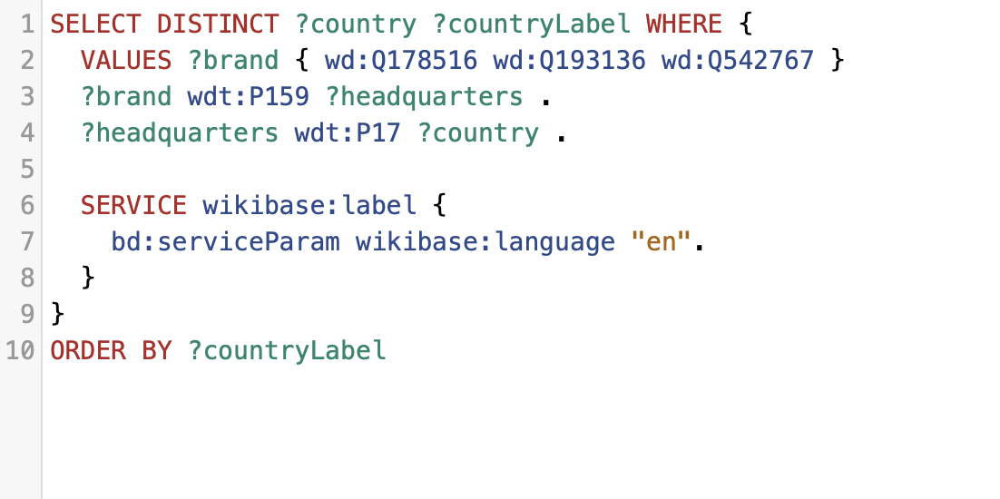
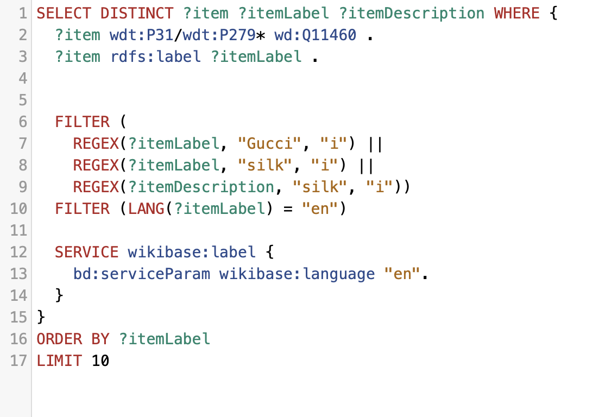
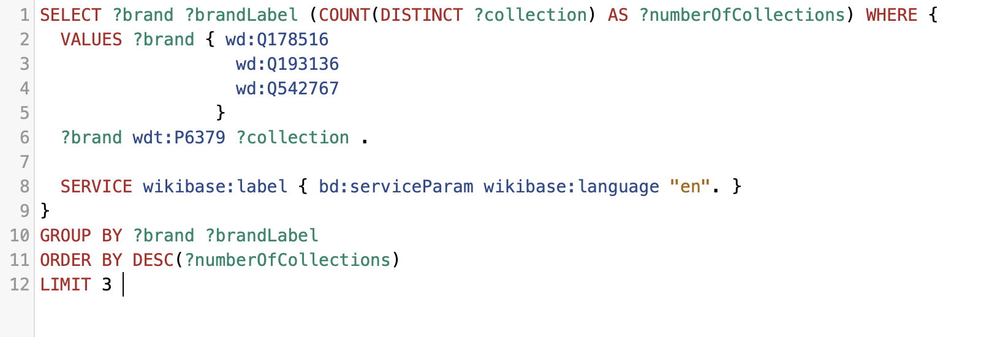

# 🧠 SPARQL Queries and LLM Prompts

This section documents the SPARQL queries and LLM prompts used to extract, verify, and enrich information about luxury fashion brands (Gucci, Prada, Dior) in Wikidata. We combined structured querying with intelligent prompting to identify gaps and generate insights.

## 🔍 SPARQL Queries

Here are the demonstrations of each mandatory SPARQL keyword: **OPTIONAL**, **DISTINCT**, **UNION**, **FILTER**, **REGEX**, **LIMIT**, and **ORDER BY**.

---
#### 1️⃣ OPTIONAL: Brands, Location, and Founder

**Purpose:** Uses `OPTIONAL` to retrieve brands and their founding locations, *optionally* including the founder's name. This ensures that even if a founder isn't linked, the brand and its location are still included, providing a comprehensive list.

📎 [Link to Wikidata Query Service Results for Query 1](https://w.wiki/ESNQ)

---
#### 2️⃣ DISTINCT: Unique Countries of Headquarters
**Purpose:** Uses `DISTINCT` to illustrate how to get a unique list of countries where these brands' headquarters are located, preventing duplicate entries for countries shared by multiple brands.

📎 [Link to Wikidata Query Service Results for Query 2](https://w.wiki/ESnx)

---
#### 3️⃣ UNION: Associated People for Gucci or Prada
**Purpose:** Employs `UNION` to combine results from different relationship types (founder, creative director, general member) to find all people associated with Gucci or Prada, regardless of their specific role.

📎 [Link to Wikidata Query Service Results for Query 3](https://w.wiki/ESn$)

---
#### 4️⃣ FILTER & REGEX: Gucci Silk Clothing Items
**Purpose:** This query expertly combines `FILTER` and `REGEX` to narrow down results. It first identifies items classified as "clothing" that are associated with "Gucci" (using `REGEX` on the label). Then, it further refines these results, ensuring that the item's label or its description also contains the word "silk" (using another `REGEX` with case-insensitivity). This dual filtering allows for highly specific data extraction based on both semantic type and textual patterns.

📎 [Link to Wikidata Query Service Results for Query 4](https://w.wiki/ESoB)

---
#### 5️⃣ LIMIT: Top 5 Common Item Types
**Purpose:** This query leverages the `LIMIT` keyword to rank Gucci, Prada, and Dior based on the number of distinct fashion collections they have documented on Wikidata. By counting and ordering these collections, it provides insight into which brand has the most extensive public record of its creative outputs, offering a robust example of `LIMIT` applied directly to our topic brands. 

📎 [Link to Wikidata Query Service Results for Query 5](https://w.wiki/ESoS)

---
#### 6️⃣ ORDER BY: Brands by Name
**Purpose:** Uses `ORDER BY` to sort the results by the brand's name (?brandLabel) in ascending alphabetical order, providing a structured and easily consumable list.

📎 [Link to Wikidata Query Service Results for Query 6](https://w.wiki/ESoZ)
